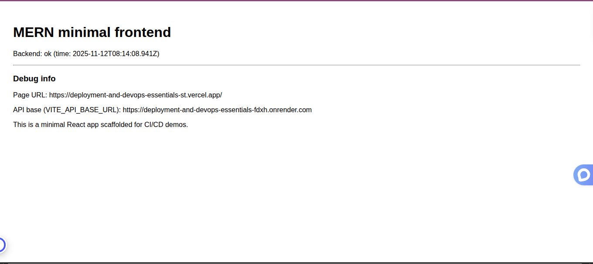
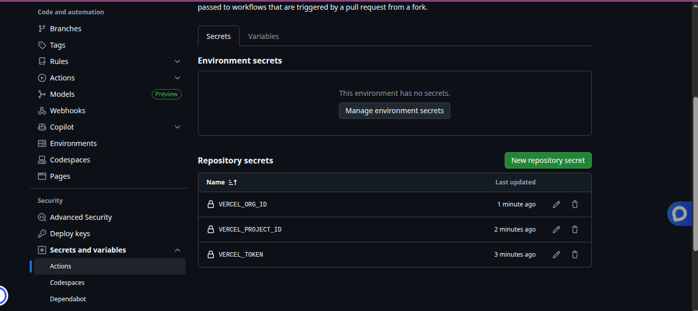

# Deployment and DevOps for MERN Applications

This assignment focuses on deploying a full MERN stack application to production, implementing CI/CD pipelines, and setting up monitoring for your application.

## Assignment Overview

You will:
1. Prepare your MERN application for production deployment
2. Deploy the backend to a cloud platform
3. Deploy the frontend to a static hosting service
4. Set up CI/CD pipelines with GitHub Actions
5. Implement monitoring and maintenance strategies

## Getting Started

1. Accept the GitHub Classroom assignment invitation
2. Clone your personal repository that was created by GitHub Classroom
3. Follow the setup instructions in the `Week7-Assignment.md` file
4. Use the provided templates and configuration files as a starting point

## Files Included

- `Week7-Assignment.md`: Detailed assignment instructions
- `.github/workflows/`: GitHub Actions workflow templates
- `deployment/`: Deployment configuration files and scripts
- `.env.example`: Example environment variable templates
- `monitoring/`: Monitoring configuration examples

## Requirements

- A completed MERN stack application from previous weeks
- Accounts on the following services:
  - GitHub
  - MongoDB Atlas
  - Render, Railway, or Heroku (for backend)
  - Vercel, Netlify, or GitHub Pages (for frontend)
- Basic understanding of CI/CD concepts

## Deployment Platforms

### Backend Deployment Options
- **Render**: Easy to use, free tier available
- **Railway**: Developer-friendly, generous free tier
- **Heroku**: Well-established, extensive documentation

### Frontend Deployment Options
- **Vercel**: Optimized for React apps, easy integration
- **Netlify**: Great for static sites, good CI/CD
- **GitHub Pages**: Free, integrated with GitHub

## CI/CD Pipeline

The assignment includes templates for setting up GitHub Actions workflows:
- `frontend-ci.yml`: Tests and builds the React application
- `backend-ci.yml`: Tests the Express.js backend
- `frontend-cd.yml`: Deploys the frontend to your chosen platform
- `backend-cd.yml`: Deploys the backend to your chosen platform

## Deployment Verification

### Live Deployment URLs
- **Frontend**: https://deployment-and-devops-essentials-st.vercel.app/
- **Backend API**: https://deployment-and-devops-essentials-fdxh.onrender.com
- **GitHub Repository**: https://github.com/StephenNafula/deployment-and-devops-essentials-StephenNafula

### Deployment Screenshots

#### Frontend Deployment
The React frontend is successfully deployed to Vercel and communicating with the backend API:

The frontend displays the application with health check status showing backend connectivity (`Backend: ok`).

#### Backend Deployment
The Express.js backend is successfully deployed to Render with MongoDB Atlas integration:

The backend service is running and ready to receive API requests from the frontend.

#### Environment Configuration
Vercel frontend environment variables are properly configured with the backend API URL:

The `VITE_API_BASE_URL` environment variable points to the Render backend, enabling the frontend to communicate with the API.

## Deployment (summary)

See `DEPLOYMENT.md` for step-by-step instructions for deploying the backend and frontend, configuring environment variables, setting up CI/CD (Render & Vercel examples), enabling HTTPS, and adding monitoring and logging. Important repository secrets you will need to add under GitHub → Settings → Secrets & variables → Actions:

- `RENDER_API_KEY` and `RENDER_SERVICE_ID` (for Render backend CD workflow)
- `VERCEL_TOKEN`, `VERCEL_PROJECT_ID`, and `VERCEL_ORG_ID` (for Vercel frontend CD workflow)

If you prefer platform-native deploys, follow the platform UI (Render or Vercel) and add the same environment variables there. `frontend/vercel.json` contains recommended caching headers and SPA routing for Vercel deployments.

## Submission

Your work will be automatically submitted when you push to your GitHub Classroom repository. Make sure to:

1. Complete all deployment tasks
2. Set up CI/CD pipelines with GitHub Actions
3. Deploy both frontend and backend to production
4. Document your deployment process in the README.md
5. Include screenshots of your CI/CD pipeline in action
6. Add URLs to your deployed applications

## Resources

- [GitHub Actions Documentation](https://docs.github.com/en/actions)
- [MongoDB Atlas Documentation](https://docs.atlas.mongodb.com/)
- [Render Documentation](https://render.com/docs)
- [Railway Documentation](https://docs.railway.app/)
- [Vercel Documentation](https://vercel.com/docs)
- [Netlify Documentation](https://docs.netlify.com/) 